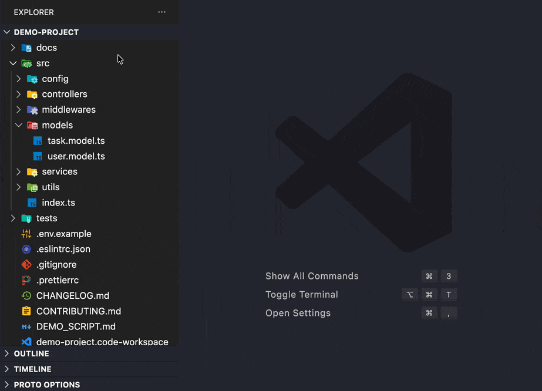
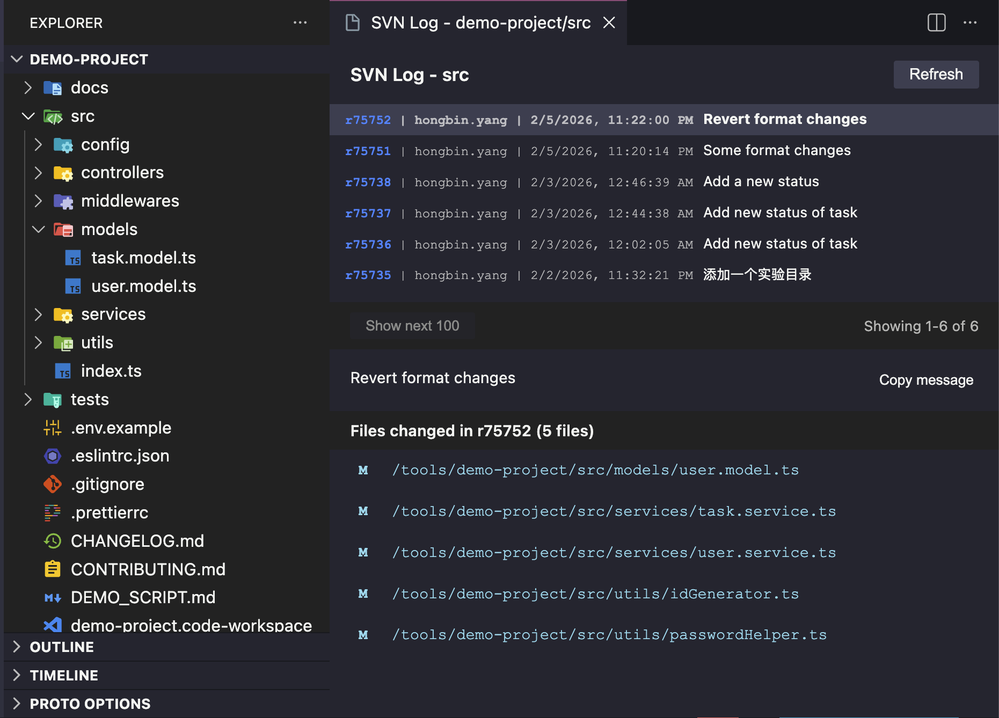
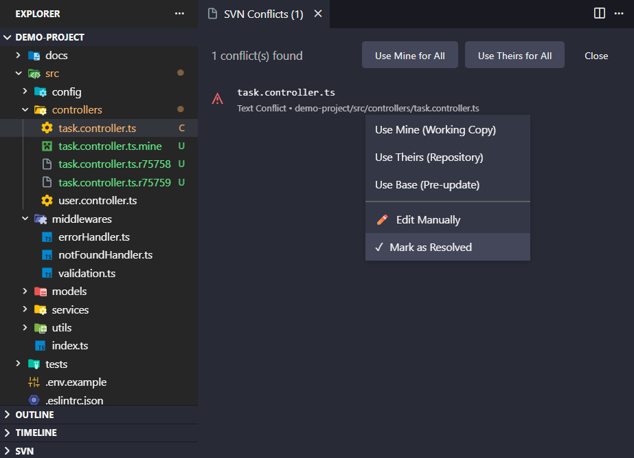

# Shellback SVN

[English](./README.md) | [简体中文](./README.zh-CN.md) | [繁體中文](./README.zh-TW.md) | [日本語](./README.ja.md) | [한국어](./README.ko.md)

Tortoise 스타일의 컨텍스트 메뉴를 통해 VS Code 파일 탐색기에서 직접 SVN 명령을 실행합니다.

참고: 이 확장 프로그램을 사용하려면 SVN CLI가 설치되어 시스템 PATH에 추가되어 있어야 합니다.

## 🚀 기능

#### TortoiseSVN 스타일

데스크톱 SVN 클라이언트와 동일한 익숙한 시각적 피드백

#### SVN 업데이트

파일 또는 전체 작업 사본 업데이트

#### SVN 커밋

메시지 히스토리 및 신규/삭제 파일 자동 감지 기능이 있는 커밋 대화 상자

#### SVN 되돌리기

확인 대화 상자와 함께 단일 또는 여러 파일 되돌리기

#### 로그 표시

커밋 히스토리, 메시지 및 변경된 파일을 표시하는 3창 로그 뷰어

#### 충돌 해결

해결 옵션(내 것 사용/상대방 것 사용/편집/차이점 비교)이 있는 시각적 충돌 패널

## 📋 요구 사항

### VS Code
- **버전**: 1.80.0 이상

### SVN 커맨드 라인 클라이언트
Shellback SVN을 사용하려면 시스템에 SVN CLI가 설치되어 있어야 합니다.

**설치 방법:**
- **macOS**: [Homebrew](https://brew.sh/)를 통해 설치 (`brew install subversion`)
- **Windows**: [TortoiseSVN](https://tortoisesvn.net/downloads.html) (설치 시 "커맨드 라인 클라이언트 도구" 선택)
- **Linux**: 배포판의 패키지 매니저를 사용하거나 [Apache SVN 공식 다운로드 페이지](https://subversion.apache.org/packages.html) 참조

설치 후 VS Code를 다시 시작하여 SVN 명령이 인식되는지 확인하십시오.

## 🎯 빠른 시작

1. **설치** VS Code 마켓플레이스에서 Shellback SVN 설치
2. **열기** SVN 작업 사본이 포함된 폴더 열기
3. **마우스 오른쪽 클릭** 탐색기 보기에서 파일 또는 폴더를 마우스 오른쪽 클릭
4. **선택** 컨텍스트 메뉴에서 SVN 명령 선택

**팁**: 메뉴 항목을 클릭할 때 `Alt` (macOS: `Option`) 키를 누른 상태로 유지하면 현재 작업 영역 루트(열려 있는 폴더)에 대해 작업을 수행할 수 있습니다.

## 🤝 피드백 및 지원

버그를 발견했거나 기능 요청이 있으신가요? [GitHub](https://github.com/shellback-labs/shellback-svn/issues)에서 이슈를 열어주세요.

---

**참고**: 이 확장 프로그램은 SVN CLI와 VS Code UI 사이의 경량 브리지로 설계되었습니다. 많은 개발자들이 수년간 의존해 온 "마우스 오른쪽 클릭" 생산성을 복원하는 데 중점을 둡니다. 원격 측정 없음, 불필요한 기능 없음.
